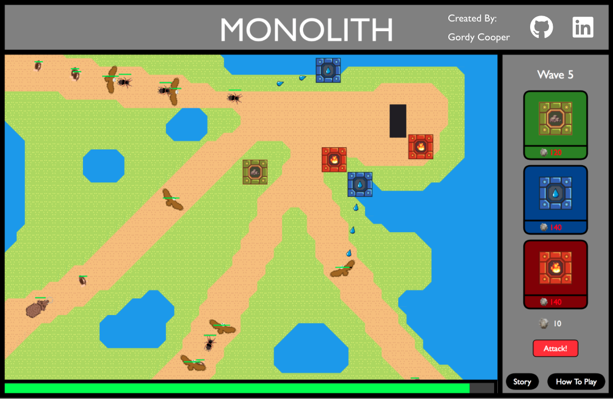

# Monolith

Monolith is a tower defense game created with vanilla JavaScript. The player's objective is to protect the monolith by building towers to damage the invaders. [Play it now!](http://gordycooper.com/Monolith)



## Background and Overview

The year is 9,000 BC. Your people have recently uncovered a mysterious ancient monolith. Perhaps it was fate, or maybe just luck. Within hours of handling the monolith, your people have experienced intense visions, sudden bouts of insight, and waves of unfathomable knowledge. As time has passed, neighboring settlements' jealousy and skepticism grows with every report about the alleged power of the monolith. Your neighbors' collective response is to band together and take the monolith for themselves, or destroy it in the process. 

It is up to you to protect the monolith! Use your new found wisdom to build towers to defend the monolith, your people, and perhaps the world if the monolith falls into the wrong hands!

## How to Play

Monolith only requires the player to place towers on the map strategically. That's it! The towers' AI will automatically target the enemies in range and damage. 

To place a tower:
  - Click on the tower you would like to place
  - Click on the map to place the tower, or outside of the map to cancel

You can place as many towers as you would like if you have enough flint. Flint is an in-game currency that is required to build towers and is earned by defeating enemies.

## Technologies

-   JavaScript
-   HTML
-   CSS

## Responsive Window Implementation

To make Monolith's game window responsive, I utilized dynamic styling using JavaScript. Originally, Monolith's UI was created with DOM elements. This did not translate well with CSS's transform scale property due to the game relying very heavily on the coordinates of the cursor on events like click and mousemove. 

I decided that the simplest solution was to refactor the UI to be created entirely with HTML5 canvas. Refactoring to canvas meant that I did not have to style individual DOM elements and I would not have to worry about mouse event coordinates transforming. All that had to be done was to dynamically set the width and height of the game window to fit the screen while maintaining the aspect ratio.

```
  const gameAspectRatio = 1850 / 1200;
  const windowW = window.innerWidth;
  const windowH = window.innerHeight;
  const windowAspectRatio = windowW / windowH;

  let newWidth;
  let newHeight;
  if (windowAspectRatio > gameAspectRatio) {
    newWidth = windowH * gameAspectRatio;
    newHeight = windowH;
    gameContainer.style.width = `${newWidth}px`;
    gameContainer.style.height = `${windowH}px`;
  } else {
    newHeight = windowW / gameAspectRatio;
    newWidth = windowW;
    gameContainer.style.width = `${windowW}px`;
    gameContainer.style.height = `${newHeight}px`;
  }
```

When the code shown above is ran, it calculates and compares the window aspect ratio to the game aspect ratio. If the window aspect ratio is greater than the game aspect ratio, the game height is set to fit the window height and a new width is calculated. If the window aspect ratio is less than the game aspect ratio, the game width is set to the window width and the new height is calculated.

## Future Features

  - Valid tower placement
  - Customizable targeting options
  - Additional waves and maps
  - Upgrade and sell towers

<!-- 

## Work Breakdown

### Day 1
  - Sprites and Map
  - Game and Game View
  - Moving Objects

### Day 2 
  - Canvas Rendering
  - Moving Objects
    - NPCs

### Day 3
  - NPC pathing
  - Towers
  - UI

### Day 4
  - Tower Targeting AI
  - Artillery

### Day 5
  - "Collision" Detection
  - NPC/Monolith Interaction

### Day 6 
  - Waves
  - Currency
  - Valid Tower Placement

### Day 7
  - Waves
  - UI
  - Styling -->